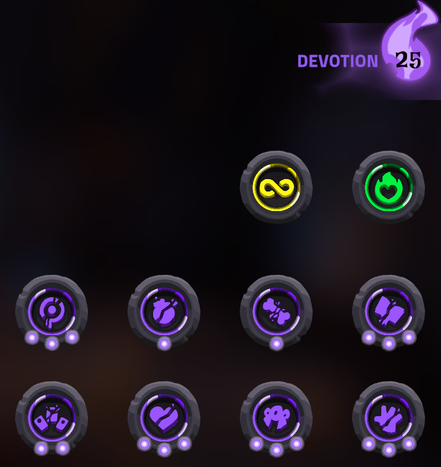
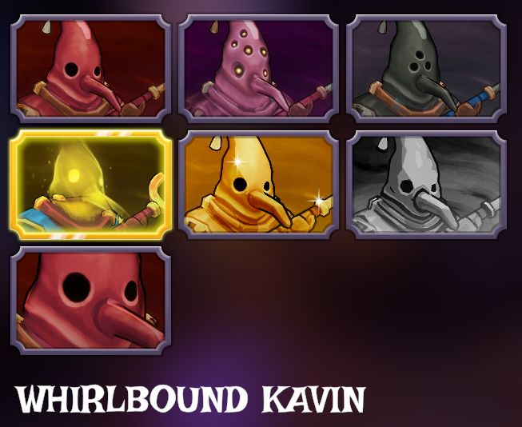

# The Spell Brigade - Save Unlocker / Trainer / Cheat Tool

Skip the insane 1.0 grind. Unlock everything in The Spell Brigade instantly. No more hundreds of hours to max covenants, prestige characters, or buy upgrades.

If you're frustrated by the 1.0 update that made the grind x3-x5 worse, removed achievement-based unlocks, and inflated upgrade costs? This tool fixes all of that in seconds.

---

## Why This Exists

The Spell Brigade 1.0 update turned a fun co-op game into a grind simulator. Players are reporting:
- Covenants locked behind 20-30 matches of grinding per character, then resetting and repeating 8+ times
- Upgrades cost so much gold that a 45-minute match barely buys one
- Characters can no longer be unlocked through achievements, only purchased with gold you were already spending on upgrades
- Hundreds of hours needed to unlock everything, even cosmetics
- Quests that are nearly impossible on hardcore difficulty

This tool lets you skip all of that and actually enjoy the game with your friends.

---

## What It Unlocks

- All quests completed (all 7 tabs: Missions, Wizards, Spells, Outfits, Scrolls, Ascension, Misc)
- All outfits and skins
- All covenants (sets characters to Prestige 2 + ascend-ready)
- All upgrades maxed
- All infusion elements
- All artifacts, objectives, and world difficulties
- 9,999,999 gold
- Steam achievements sync automatically on game launch

Works on brand new saves and existing saves. Your save is always backed up first.

---

## How to Use

### 1. Install Python
Download from https://www.python.org/downloads/ and check **"Add Python to PATH"** during install.

### 2. Install the required library
Open Command Prompt and run:
```
pip install pycryptodome
```

### 3. Close the game completely

### 4. Run the unlocker
Double-click `spell_brigade_unlocker.py` or run from Command Prompt:
```
python spell_brigade_unlocker.py
```

### 5. Press 1 for Unlock All, then Y to confirm

### 6. Launch the game

---

## Options

### 1. Unlock All
Everything listed above in one shot. Best for most people.

### 2. Custom Prestige
Set a specific prestige level for all characters. Prestige is the progression system where you reset a character's rank to gain permanent bonuses and new abilities. Higher prestige = stronger characters. Prestige 2 unlocks all covenants (passive perks).

### 3. Challenges Only
Complete every quest across all 7 tabs (Missions, Wizards, Spells, Outfits, Scrolls, Ascension, Misc) without changing your characters. Good if you just want the quest rewards but want to keep leveling characters yourself.

### 4. Infusions Only
Discover all 21 elements used in the infusion system. Infusions are elemental combinations you normally find during gameplay that boost your spells.

### 5. Ascend-Ready Only
Set all characters to Rank 10 (max rank) so they're ready to ascend. Ascending is when you reset a character's rank back to 1 in exchange for a prestige level. This option doesn't actually ascend them, it puts them at the doorstep so you can do it yourself in-game.

### 6. Custom Combo
Pick and choose which unlocks you want. Lets you mix and match any of the above options.

### 7. Set Gold
Set your gold to any amount you want.

---

## FAQ

**Will this get me banned?**
No. The Spell Brigade is PvE co-op with no anti-cheat. Saves are local.

**Can I undo it?**
Yes. The tool creates a backup folder each time. Copy the files back to restore.

**Where is my save folder?**
The tool finds it automatically. If it can't, press Win+R and paste:
```
%userprofile%\AppData\LocalLow\BoltBlasterGames\TheSpellBrigade
```

**My changes didn't work**
Make sure the game is fully closed (check system tray). If your save got reset, restore from the backup folder.

**"pycryptodome" or "Crypto" error**
Run `pip install pycryptodome`. If that fails, try `python -m pip install pycryptodome`.

**"python is not recognized"**
Reinstall Python and check "Add Python to PATH" during install.

**Steam Deck / Linux?**
Works on any OS with Python. Save path on Proton:
```
~/.steam/steam/steamapps/compatdata/[APPID]/pfx/drive_c/users/steamuser/AppData/LocalLow/BoltBlasterGames/TheSpellBrigade/
```
Run the script and paste the path when prompted.

---

## Spell Brigade Guides. The Fast Way

### How to Unlock Covenants in The Spell Brigade
Normally you need to reach Prestige 2 on each character to unlock all their covenants. That means hitting max rank (Rank 10), ascending, grinding back to Rank 10, and ascending again, per character. With this tool, run "Unlock All" and every character is set to Prestige 2 with all covenants unlocked instantly.



### How to Ascend in The Spell Brigade
To ascend a character, you need to reach Rank 10 (max rank). Once there, you can reset back to Rank 1 in exchange for a prestige level. Each prestige unlocks new covenants and permanent bonuses. Use the "Ascend-Ready" option to instantly set all characters to Rank 10 so you can ascend them yourself, or use "Unlock All" to skip straight to Prestige 2.

### How to Unlock Abstinence (Solitary Focus) in The Spell Brigade
The Abstinence covenant (previously called Solitary Focus) requires you to level a spell to Level 20 and prestige specific characters 2 times each, a massive grind after the 1.0 update. This tool unlocks it along with every other covenant instantly.

### How to Get All Wizards in The Spell Brigade
All wizards and their upgrades are unlocked through the progression system. Instead of grinding gold to purchase each one after the 1.0 update removed achievement unlocks, use "Unlock All" to get every wizard, outfit, and skin immediately.



### How to Get More Gold in The Spell Brigade
After 1.0, upgrade costs were inflated so much that a 45-minute match barely earns enough for one upgrade. This tool lets you set your gold to 9,999,999 (or any amount you want) so you can buy whatever you need.

### Spell Brigade Ascension Guide
Ascension is the prestige system in The Spell Brigade. Each time you ascend a character (at Rank 10), they reset to Rank 1 but gain a prestige level, unlocking new covenants and permanent buffs. Prestige 2 unlocks all covenants for a character. This tool can set any prestige level you want across all characters.

### Spell Brigade All Covenants List
Covenants are passive perks unlocked through the prestige system. Each character has unique covenants that unlock at Prestige 1 and Prestige 2. Rather than grinding each character to Prestige 2 individually (which can take 20-30+ matches each), this tool unlocks all covenants for every character at once.

### Spell Brigade Infusion Elements
Infusions are elemental combinations that boost your spells. There are 21 elements to discover during gameplay. The "Infusions Only" option instantly discovers all 21 elements so you can start experimenting with builds right away.

---

## Keywords

The Spell Brigade save editor, The Spell Brigade trainer, The Spell Brigade cheat, Spell Brigade unlock all, Spell Brigade grind fix, Spell Brigade covenant unlock, Spell Brigade prestige hack, Spell Brigade gold hack, Spell Brigade 1.0 update fix, Spell Brigade save file editor, Spell Brigade all achievements, Spell Brigade max upgrades, Spell Brigade all outfits, Spell Brigade all spells, Spell Brigade modding tool, Spell Brigade how to ascend, Spell Brigade ascension guide, Spell Brigade how to unlock covenants, Spell Brigade all covenants, Spell Brigade abstinence unlock, Spell Brigade solitary focus, Spell Brigade wizards unlock, Spell Brigade mods, Spell Brigade infusion elements, Spell Brigade prestige guide, Spell Brigade rank 10, Spell Brigade how to prestige, Spell Brigade covenant list, Spell Brigade all wizards, Spell Brigade upgrade costs
